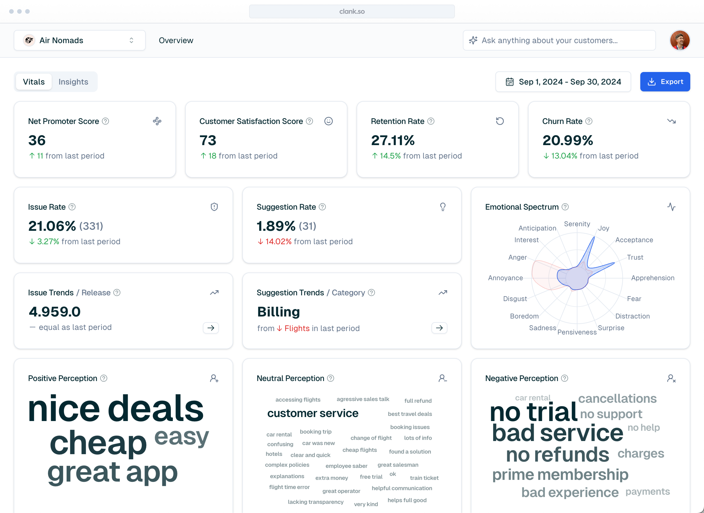
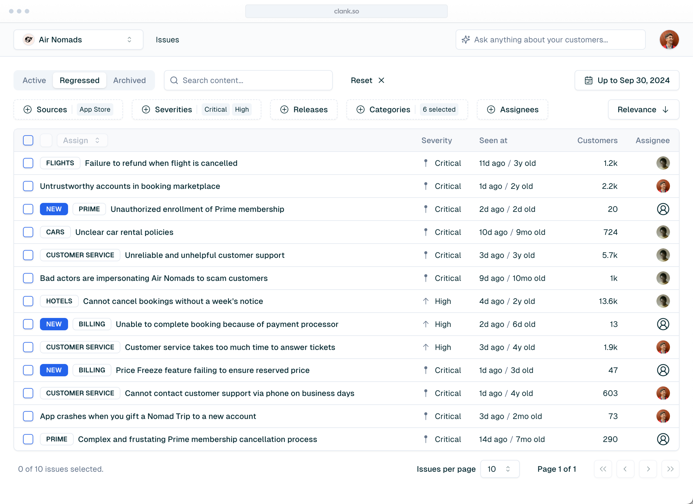
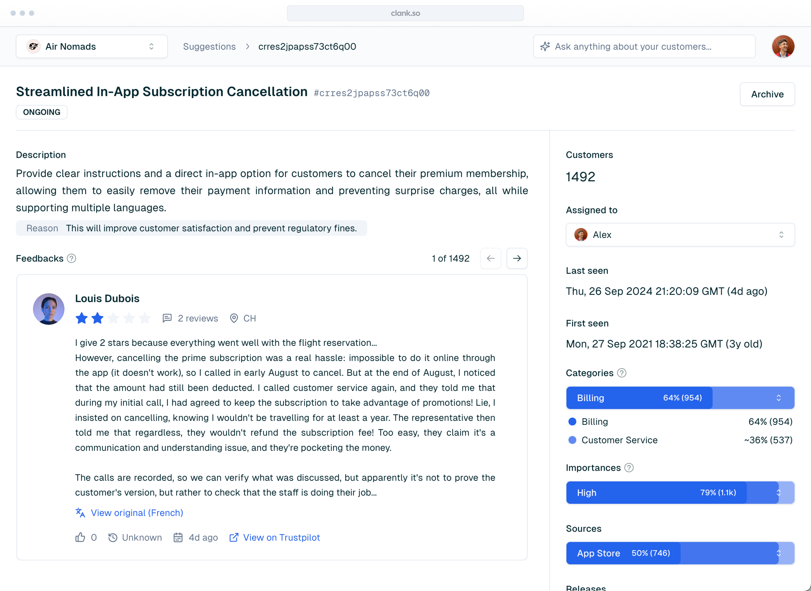
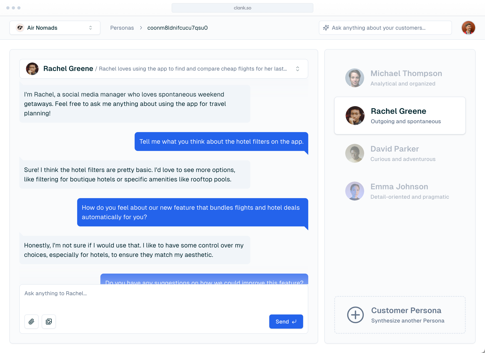

# clank 🤖

**`Collect and analyze customer feedback, identify issues and suggestions, predict churn and retention, track CX KPIs and synthesize interactive customer personas.`**

# Backstory

Clank is a _failed_, solopreneur attempt, of building a B2B (bootstrapped) startup. I designed and envisioned it as _the_ SaaS tool to help companies build better products, by collecting and analyzing customer feedback at scale with AI.

> **TLDR of why it failed:** I didn’t have enough authority _(and motivation)_ to make companies believe in Clank and its services.

Clank was a B2B targeted to big companies, a great amount of reviews was needed for my tool to make sense. I was an outsider of the customer experience field, a solopreneur without a personal brand, that didn't even have connections in the industry.

As it was a B2B, the selling process was very long and not really automatizable. Everyday, I had to be, all the time, in a lot of meetings, with a lot of different companies, and at the end, I realized that was not what I wanted to do with my life.

> I love creating things, making products, but not selling them.

I'm proud of what I achieved and implemented, and I wanted to save my work for future reference, so I open sourced it.

# Features

Centralize customer feedback to uncover insights and make informed product decisions.

## Metrics & Insights

React to trends as they are happening, predict churn and retention, track NPS, CSAT and other CX KPIs, and measure vital brand metrics.

## Issues

Identify frequent problems, pinpoint critical customer pains and improve your product based on customer insights.

## Suggestions

Address common requests, ship what customers really want and reach product-market fit.

## Customer Personas

Synthesize interactive personas from the knowledge of all your customers. Discover what they think of your product and uncover valuable insights in real time.

# How it Works

Focus on shipping while we take care of your customer feedback.

## 1. Bring in customer feedback, from various sources

Clank integrates with platforms customers already use, meaning you can get started right now. Clank's infrastructure is scalable by default and custom solutions can be set-up effortlessly.

## 2. Leverage our state-of-the-art AI engine and save days spent on manual analysis

Clank is a tool that works for you, literally. No more wasting time reading thousands of reviews. Forget about never-ending spreadsheets. Our AI-powered engine is able to identify common issues and suggestions, synthesize interactive customer personas, predict churn and retention and measure vital KPIs.

## 3. Uncover valuable insights from trending issues, suggestions and customer personas

Clank's analytics transforms raw feedback into clear, actionable insights. From KPIs to customer personas, Clank makes it easy to know your customers better than ever before. Pinpoint critical customer pains and ship requested features. Interact with your customer personas and discover valuable insights in real time.

## 4. Make informed product decisions and delight customers

Clank helps your entire organization stay connected to customer feedback. With in-depth insights at your fingertips, you can now build what customers want, not what you think they need. Understand how your new feature is seen by your customers before it flops in the market. Discover emerging trends and stay ahead of your competitors.

# Landing

# Contribute

Although I always love contributions, this project is stalled and archived : ) .

# License

This project is licensed under the [GPL-3.0 License](https://opensource.org/license/gpl-3-0), read the [LICENSE](LICENSE) file for details.
